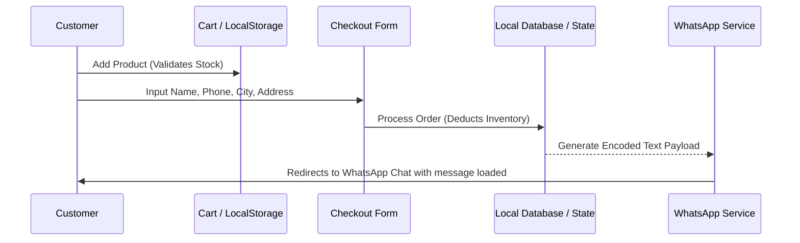

# 05. E-COMMERCE SPECIFICATION

This specification outlines the business rules and guest checkout flows.

---

## 1. Shop Page Operations
* **Product Catalog Display:** `/shop` renders the entire active inventory, excluding items explicitly hidden by the administrator.
* **Featured Sorting Order:** By default, items are displayed in a manual priority order set by the admin (e.g., placing the signature *Eragon* perfume and flagship *Musk Dahab* hair mist at the top).
* **Grid Controls:**
  * **Category Filter:** Clicking pills filters products instantly without page reloads.
  * **Price Range Selector:** Dynamic slider or inputs to filter by cost.
  * **Search Bar:** Real-time character filtering against product titles, descriptions, and SKU codes.
  * **Sorting Dropdown:** Allows sorting by:
    - Default (Featured)
    - Newest Arrivals
    - Price: Low to High
    - Price: High to Low
    - Best Sellers

---

## 2. Universal Cart Rules
* **No Authentication:** Cart data is stored locally in client-side state and persisted to `localStorage` (key: `dahab_cart`).
* **Quantity Guard Rails:** Customers cannot add more items than the stock quantity logged in the database.
* **Sliding Panel Trigger:** Adding an item to the cart automatically opens the side Drawer cart to confirm the action.

---

## 3. Wishlist Mechanics
* **Save Feature:** Heart buttons on catalog items write the product ID directly to local storage (`dahab_wishlist`).
* **Instant Listing:** `/wishlist` displays a clean grid of saved products, allowing users to quickly move desired items into the active cart.

---

## 4. Product Stock Statuses
The store handles three distinct stock states:
* **Available:** Stock count is above 5. Render standard "Add to Cart" options.
* **Low Stock:** Stock count is between 1 and 5. Displays a warning badge ("Only [Count] items left!") to encourage completion.
* **Out of Stock:** Stock count is 0. Keep the detail page visible for SEO, but disable checkout buttons, display an "Out of Stock" badge, and offer a "WhatsApp Inquiry" CTA.

---

## 5. Shipping & Delivery Logistics
* **Geographical Limits:** Shipping is strictly limited to locations within the Hashemite Kingdom of Jordan.
* **Shipping Pricing Structure:**
  - Amman: **2.00 JOD** (Delivered in 24 - 48 Hours)
  - Zarqa / Irbid / Salt: **3.00 JOD** (Delivered in 48 - 72 Hours)
  - Aqaba / Southern Areas / Remote locations: **4.00 JOD** (Delivered in 72+ Hours)
* **Editable Settings:** Shipping rates and transit estimates must be manageable from the admin settings panel.

---

## 6. Payment Modes
* **Cash on Delivery (COD) (Primary):** The default checkout method.
* **Visa/Card Payment (Secondary):** Rendered as a placeholder option showing: *"Online Payment is temporarily unavailable. Cash on Delivery only."*

---

## 7. Direct WhatsApp Order Redirection
Once a user fills out the delivery form and clicks "Confirm Order," the system automatically redirects them to WhatsApp to complete the purchase.

### Redirection Target
`https://wa.me/962785050655`

### Formatted Payloads (Arabic Template)
```text
مرحباً DAHAB PERFUMES، أود تأكيد الطلب التالي:

رقم الطلب: #DH-1002
اسم العميل: محمد أحمد
رقم الهاتف: 0791234567
المدينة: عمان
العنوان: شارع الجاردنز، بناء 14، الطابق الثاني

المنتجات المطلوبة:
1. هيرميست مسك دهب (العدد: 2) - 40.00 JOD
2. عطر إيراغون 100 مل (العدد: 1) - 45.00 JOD

الحساب الإجمالي:
- مجموع المنتجات: 85.00 JOD
- رسوم التوصيل: 2.00 JOD
- المجموع الكلي: 87.00 JOD

ملاحظات العميل: يرجى الاتصال قبل التوصيل.
```

### Formatted Payloads (English Template)
```text
Hello DAHAB PERFUMES, I would like to confirm my order:

Order Reference: #DH-1002
Customer Name: Mohammad Ahmad
Phone: 0791234567
City: Amman
Address: Gardens Street, Building 14, 2nd Floor

Items Ordered:
1. Musk Dahab Hair Mist (Qty: 2) - 40.00 JOD
2. Eragon Perfume 100ml (Qty: 1) - 45.00 JOD

Order Summary:
- Subtotal: 85.00 JOD
- Delivery Fee: 2.00 JOD
- Total Amount: 87.00 JOD

Notes: Please call before delivery.
```

---

## 8. Guest Checkout Flow Diagram


