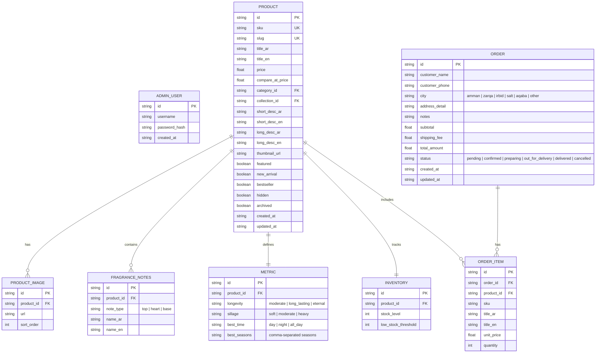

# 08. DATABASE ARCHITECTURE

This document maps out the entity relational structures and schema fields to persist storefront products, inventory records, and order logs.

---

## 1. Entity Relationship Diagram (Conceptual Layout)

---

## 2. Table Schemas & Fields

### A. Table: `ADMIN_USER`
* `id`: `UUID` (Primary Key, unique string)
* `username`: `VARCHAR(50)` (Unique admin handle)
* `password_hash`: `VARCHAR(255)` (Salted hash or static match payload)
* `created_at`: `TIMESTAMP`

### B. Table: `PRODUCT`
* `id`: `UUID / VARCHAR(50)` (Primary Key)
* `sku`: `VARCHAR(50)` (Unique code, indexed)
* `slug`: `VARCHAR(100)` (Unique URL string, indexed)
* `title_ar`: `VARCHAR(255)` (Arabic display title)
* `title_en`: `VARCHAR(255)` (English display title)
* `price`: `DECIMAL(10, 2)` (Catalog price)
* `compare_at_price`: `DECIMAL(10, 2)` (Before discount price, nullable)
* `category_id`: `VARCHAR(50)` (Classification identifier)
* `collection_id`: `VARCHAR(50)` (Collection identifier)
* `short_desc_ar`: `TEXT`
* `short_desc_en`: `TEXT`
* `long_desc_ar`: `TEXT`
* `long_desc_en`: `TEXT`
* `thumbnail_url`: `VARCHAR(2083)` (Main card image)
* `featured`: `BOOLEAN` (Default: `false`)
* `new_arrival`: `BOOLEAN` (Default: `false`)
* `bestseller`: `BOOLEAN` (Default: `false`)
* `hidden`: `BOOLEAN` (Default: `false`)
* `archived`: `BOOLEAN` (Soft delete flag, default: `false`)
* `created_at`: `TIMESTAMP`
* `updated_at`: `TIMESTAMP`

### C. Table: `PRODUCT_IMAGE`
* `id`: `UUID` (Primary Key)
* `product_id`: `VARCHAR(50)` (Foreign Key linking to `PRODUCT.id`)
* `url`: `VARCHAR(2083)` (Image CDN link)
* `sort_order`: `INTEGER` (Order display sequence)

### D. Table: `INVENTORY`
* `id`: `UUID` (Primary Key)
* `product_id`: `VARCHAR(50)` (Foreign Key linking to `PRODUCT.id`)
* `stock_level`: `INTEGER` (Current available count)
* `low_stock_threshold`: `INTEGER` (Warning limit, default: `5`)

### E. Table: `ORDER`
* `id`: `VARCHAR(30)` (Primary Key, unique reference code e.g., `DH-1002`)
* `customer_name`: `VARCHAR(150)`
* `customer_phone`: `VARCHAR(20)` (Jordan validation regex pattern)
* `city`: `VARCHAR(20)`
* `address_detail`: `TEXT`
* `notes`: `TEXT` (Optional checkout notes)
* `subtotal`: `DECIMAL(10, 2)`
* `shipping_fee`: `DECIMAL(10, 2)`
* `total_amount`: `DECIMAL(10, 2)`
* `status`: `VARCHAR(30)` (Status dropdown option, default: `pending`)
* `created_at`: `TIMESTAMP`
* `updated_at`: `TIMESTAMP`

### F. Table: `ORDER_ITEM`
* `id`: `UUID` (Primary Key)
* `order_id`: `VARCHAR(30)` (Foreign Key linking to `ORDER.id`)
* `product_id`: `VARCHAR(50)` (Foreign key linking to `PRODUCT.id`)
* `sku`: `VARCHAR(50)`
* `title_ar`: `VARCHAR(255)`
* `title_en`: `VARCHAR(255)`
* `unit_price`: `DECIMAL(10, 2)`
* `quantity`: `INTEGER`
