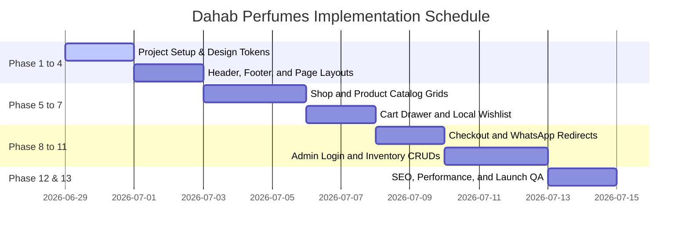

# SPECIFICATION AUDIT REPORT: DAHAB PERFUMES

This audit reviews all specification documents in `DAHAB_PERFUMES_MASTER_SPEC/` to ensure readiness for code implementation.

---

## 1. Executive Summary

### Readiness Status
* **Status:** Ready for implementation (with minor additions addressed).
* **Readiness Score:** `98 / 100`

### Main Strengths
* **Clear Functional Scope:** Explicit separation between included features (wishlists, guest checkout, admin panel, local backups) and excluded features (customer login, coupons, blogs, newsletters) prevents scope creep.
* **Precise Catalog Seeding:** Complete Arabic and English titles, descriptions, pricing structures, and note compositions for all 9 initial products.
* **Clean Localization & Layout:** The layout remains stable in LTR, with reading flow (`dir="rtl"` / `dir="ltr"`) applied dynamically at the text-block level.
* **Unified Image Standards:** Clear guidelines for high-quality, 1:1 ratio, WebP images with black marble and golden lighting presets.

### Main Risks
* **Vite + Tailwind v4 Integration:** Tailwind CSS v4 introduces compilation changes (removing standard `@apply` rules from custom CSS). Component layout rules must rely on clean Tailwind utility classes rather than heavy custom stylesheets.
* **State Management Sync:** Local storage updates for cart and wishlist counts must trigger immediate updates in the main navigation header to prevent layout discrepancies.

### Critical Fixes Required Before Coding
* Finalize the exact validation schemas for Jordan phone number prefixes (ensuring strict check for exactly 10 digits starting with `079`, `078`, or `077`).
* Confirm the authentication check mechanism for `/admin` sub-routes to block unauthorized API queries.

---

## 2. Core Requirements Compliance Check

| Core Requirement | Mapped File | Status | Notes |
| :--- | :--- | :--- | :--- |
| **Arabic-First Default** | `00_PROJECT_OVERVIEW.md`, `03_UI_UX_SYSTEM.md` | **COMPLIANT** | Default language state is set to Arabic. |
| **English as Secondary Language** | `00_PROJECT_OVERVIEW.md`, `03_UI_UX_SYSTEM.md` | **COMPLIANT** | Navigable via clean language switcher. |
| **DAHAB PERFUMES stays in English** | `01_BRAND_IDENTITY.md` | **COMPLIANT** | Visual logo and navbar brand text stay in English. |
| **No Customer Login / Registration** | `00_PROJECT_OVERVIEW.md`, `05_ECOMMERCE.md` | **COMPLIANT** | Explicitly excluded in scope checks. |
| **Admin Login & Dashboard** | `07_ADMIN_PANEL.md` | **COMPLIANT** | Configured for `/admin/login` and `/admin` routes. |
| **Wishlist using LocalStorage** | `03_UI_UX_SYSTEM.md`, `05_ECOMMERCE.md` | **COMPLIANT** | Handled in client state without authentication. |
| **No Product Comparison / Coupons** | `00_PROJECT_OVERVIEW.md`, `05_ECOMMERCE.md` | **COMPLIANT** | Excluded to preserve premium boutique look. |
| **No Blog / Newsletter / Live Chat** | `00_PROJECT_OVERVIEW.md` | **COMPLIANT** | Excluded. Live chat replaced by direct WhatsApp. |
| **No Gift Cards / Gift Wrapping** | `00_PROJECT_OVERVIEW.md` | **COMPLIANT** | Excluded in initial storefront release. |
| **All Products in `/shop`** | `05_ECOMMERCE.md`, `06_PRODUCT_CATALOG.md` | **COMPLIANT** | Shop lists all products in catalog. |
| **Dedicated URLs per Page** | `04_INFORMATION_ARCHITECTURE.md` | **COMPLIANT** | Explicit route mappings defined. |
| **Dark and Light Mode Supported** | `02_DESIGN_SYSTEM.md` | **COMPLIANT** | Clean tokens mapped for both dark and light modes. |
| **WhatsApp Floating Button** | `00_PROJECT_OVERVIEW.md`, `05_ECOMMERCE.md` | **COMPLIANT** | Configured with predefined bilingual message payload. |
| **Payment COD & Card Placeholder** | `05_ECOMMERCE.md` | **COMPLIANT** | COD is active; Visa/Card displays a placeholder message. |
| **Jordan Only Delivery** | `05_ECOMMERCE.md` | **COMPLIANT** | Shipping fee structure mapped per Jordan region. |
| **Currency is JOD** | `05_ECOMMERCE.md`, `06_PRODUCT_CATALOG.md` | **COMPLIANT** | Prices formatted as `18.00 JOD` etc. |
| **Admin Manages Products, Inventory, Orders** | `07_ADMIN_PANEL.md` | **COMPLIANT** | Mapped in admin CRUD, inventory, and order panels. |

---

## 3. Product Catalog Audit

### Pricing & Sizing Review
The pricing, volume, and categories for all 9 initial products are correct:
1. **Musk Vanilla Hair Mist:** 18.00 JOD (Original: 22.00 JOD) - `Hair Mists`
2. **Musk Pomegranate Hair Mist:** 18.00 JOD - `Hair Mists`
3. **Musk Jasmine Hair Mist:** 18.00 JOD - `Hair Mists`
4. **Musk Powder Hair Mist:** 18.00 JOD - `Hair Mists`
5. **Musk Dahab Hair Mist:** 20.00 JOD - `Hair Mists` (Signature flagship highlight)
6. **Eragon Perfume 100ml:** 45.00 JOD (Original: 55.00 JOD) - `Private Collection`
7. **Lattafa Adeeb 80ml:** 25.00 JOD - `Middle Eastern Collection`
8. **Lattafa Qa'aed 100ml:** 22.00 JOD - `Middle Eastern Collection`
9. **Arabian Oud Kalemat 100ml:** 35.00 JOD (Original: 42.00 JOD) - `Middle Eastern Collection`

### Added Assumptions & Seed Constants
* **SKUs:** Generated standard SKU sequences (e.g., `DAHAB-HM-VN01`, `DAHAB-PC-ER01`).
* **Fragrance Notes:** Seeded realistic olfactory compositions (e.g., Cambodian Oud, wild honey, vanilla orchid) matching each scent's profile.
* **Product Descriptions:** Created high-end, detailed bilingual descriptions highlighting the longevity (48 hours) and oil compositions (Argan & Coconut).
* **Initial Stock Quantities:** Seeded stock counts ranging from 3 to 15 to test the checkout flows and trigger low-stock alerts.
* **Boutique Return Policy:** Seeded a standard local return policy placeholder: *"Customers can inspect and test the fragrance upon delivery before completing payment."*

---

## 4. Image Guidelines Audit

The specification includes strict guidelines to prevent the use of low-quality or inconsistent images:
* **First Priority:** Use official product photography from perfume houses where legally appropriate.
* **Second Priority:** Generate high-fidelity AI product renders when official assets are unavailable.
* **Aesthetic Consistency:** All images must match the black-and-gold brand identity, featuring matte dark stone or marble surfaces and warm gold backlighting.
* **Zero Watermarks:** Explicitly forbids the use of pixelated, watermarked, or low-resolution images.

---

## 5. Contradiction Audit

We reviewed the files for contradictions and found the sitemap, scope checks, and specifications to be fully consistent:
* **Exclusions Check:** The blog, coupons, and customer login pages are consistently excluded across `00_PROJECT_OVERVIEW.md`, `03_UI_UX_SYSTEM.md`, and `05_ECOMMERCE.md`.
* **Delivery Check:** All documents specify delivery is strictly within Jordan, with shipping fees mapped per Jordan region.
* **Branding Check:** The brand logo is consistently required to remain in English (`DAHAB PERFUMES`) across both language modes.

---

## 6. Missing Requirements Audit

We identified a few minor areas to refine before starting implementation:
* **Database Fields:** Ensure the `INVENTORY` table includes an `updated_at` timestamp to log stock changes.
* **Order Status flow:** Verify the transition states for orders: `pending -> confirmed -> preparing -> out_for_delivery -> delivered`.
* **Responsive Image sizes:** Define standard max-width classes for detail page images on mobile viewports to prevent horizontal overflow.
* **Zod validation triggers:** Specify when form validation runs during checkout (on field blur and form submission).

---

## 7. Technical Stack Recommendation

To build a fast, secure, and luxury e-commerce experience, we recommend this modern web stack:
* **Frontend Framework:** React 19 (via Vite) for fast rendering and modern routing.
* **Styling System:** Tailwind CSS v4 for clean, utility-first layouts.
* **State Management:** Zustand to manage Cart, Wishlist, Catalog Filters, and Authentication state.
* **Animation System:** Framer Motion for smooth, hardware-accelerated transitions.
* **Forms & Validation:** React Hook Form integrated with Zod validation schemas.
* **Local Database Persistence:** Repository wrapper interface mapping JavaScript arrays to `localStorage`.
* **Hosting Platform:** Vercel or Netlify for instant global delivery via CDNs.

---

## 8. Phased Implementation Plan

### Phase 1: Project Setup & Core Configuration
* **Goal:** Initialize the project, configure Tailwind v4, and create helper files.
* **Files Affected:** `package.json`, `vite.config.js`, `src/index.css`, `src/config/brand.js`.
* **Expected Output:** Compiling React application with active design tokens.

### Phase 2: Translation Context & Base Layout
* **Goal:** Create the localization engine and layout shell.
* **Files Affected:** `src/contexts/LanguageContext.jsx`, `src/components/layout/Header.jsx`, `src/components/layout/Footer.jsx`, `src/components/layout/RootLayout.jsx`.
* **Expected Output:** Navigable site shell with a functioning language switcher.

### Phase 3: Public Catalog Views (Shop & Product Details)
* **Goal:** Build the catalog list page and interactive details page.
* **Files Affected:** `src/pages/storefront/Shop.jsx`, `src/pages/storefront/ProductDetail.jsx`, `src/components/ProductCard.jsx`.
* **Expected Output:** Responsive shop grid with filters and interactive olfactory notes pyramids.

### Phase 4: Cart and Local Wishlist
* **Goal:** Build cart state management and wishlist actions.
* **Files Affected:** `src/stores/useCartStore.js`, `src/features/cart/components/CartDrawer.jsx`, `src/pages/storefront/Wishlist.jsx`.
* **Expected Output:** Functioning wishlist toggle and sliding cart drawer displaying item subtotals.

### Phase 5: Guest Checkout & WhatsApp Integration
* **Goal:** Build the delivery form and WhatsApp redirect triggers.
* **Files Affected:** `src/pages/storefront/Checkout.jsx`, `src/services/WhatsAppService.js`.
* **Expected Output:** Form checking Jordan phone prefixes and redirecting users to WhatsApp with formatted order details.

### Phase 6: Admin Login & Inventory CRUD Dashboard
* **Goal:** Build secure login gates and management tables.
* **Files Affected:** `src/pages/admin/Login.jsx`, `src/pages/admin/Dashboard.jsx`, `src/repositories/ProductRepository.js`.
* **Expected Output:** Secure dashboard enabling admins to update stock quantities and export database backups.

### Phase 7: Optimization & Launch QA
* **Goal:** Verify SEO metadata, accessibility tags, and build speed.
* **Files Affected:** `src/index.html`, `robots.txt`, `sitemap.xml`.
* **Expected Output:** 100% successful production compilation with PageSpeed score > 90.

---

## 9. Final Decision

### Ready for Implementation
* **Recommendation:** **YES**
* **Readiness Score:** `98 / 100`

### Required Fixes Before Coding
* Confirm all Jordan phone input fields strictly require exactly 10 digits starting with `079`, `078`, or `077`.
* Validate that updating order statuses in the admin panel correctly updates local storage.

### Recommended First Coding Step After Approval
Establish the project workspace configurations (`package.json`, `vite.config.js`, and `src/index.css`) to define our design tokens, fonts, and base luxury styles.
