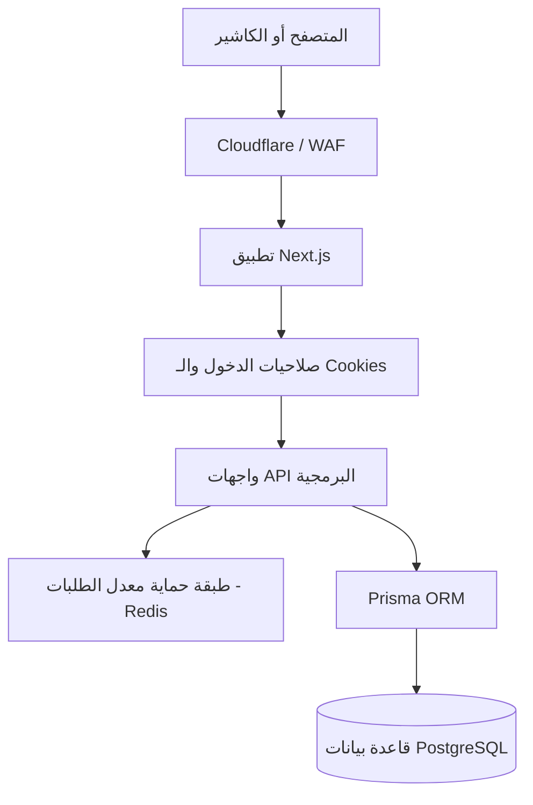

# DAHAB PERFUMES — Luxury E-Commerce & POS Terminal
## تقرير المشروع الشامل والمفصل (المعمارية، سير العمل، وهيكل الملفات)

---

## 1. نظرة عامة على المشروع (Executive Overview)
مشروع **DAHAB PERFUMES** هو منصة تجارة إلكترونية فاخرة متكاملة مخصصة لبيع العطور الفخمة وتركيبات النيش والزيوت العطرية. تم بناء الموقع بهويتين أساسيتين:
1. **واجهة العميل (B2C Storefront)**: واجهة راقية مستوحاة من ألوان الذهب والأسود الملكي، تتيح للعملاء استعراض العطور الفاخرة وشراءها عبر سلة المشتريات والطلب المباشر عبر الواتساب مع حماية أمنية للطلبات.
2. **نظام الكاشير والمبيعات (B2B Tablet POS)**: واجهة كاشير مخصصة للعمل داخل الفروع وعلى شاشات اللمس (Tablets)، تتميز بالسرعة الفائقة، وتتبع المخزون اللحظي للأحجام، وحساب الفواتير، ونظام توقف ذكي (Screensaver) يظهر ساعة رقمية وشعار داهب الملكي عند الخمول لمنع تداخل اللمسات.
3. **لوحة التحكم للمدير (Admin Dashboard)**: لإدارة المنتجات، التصنيفات، العروض، المخزون، صلاحيات الموظفين (RBAC)، واستعراض تقارير الأمان والمبيعات اليومية.

---

## 2. البنية التكنولوجية المستخدمة (Technology Stack)
* **الإطار البرمجي (Framework)**: Next.js 15 (App Router) مع React 19.
* **التصميم والتنسيق (Styling)**: Tailwind CSS مع نظام ألوان موحد (Luxury CSS Design System) يعتمد على تدرجات الأسود Obsidian والذهبي الملكي وتأثيرات الزجاج (Glassmorphism) بدون استخدام إطارات عمل ثقيلة للأنيميشن لضمان السرعة القصوى.
* **قاعدة البيانات (Database)**: PostgreSQL (مستضافة على Supabase) للتعامل الآمن مع البيانات المترابطة.
* **مستوى معالجة البيانات (ORM)**: Prisma Client لإدارة العمليات والاستعلامات على قاعدة البيانات بسلاسة وأمان.
* **الأمان ومكافحة الهجمات (Security & Rate Limiting)**: 
  * استخدام **Redis (ioredis)** بنمط الـ Singleton لحظر عناوين الـ IP المزعجة وحماية نماذج الاتصال والـ Server Actions من إغراق الطلبات.
  * نظام حماية ضد التخمين والتجربة المتكررة (Brute-force protection).
  * ترويسات أمان صارمة (CSP, X-Frame-Options, XSS Protection).
* **إدارة الحالات (State Management)**: React Contexts لإدارة سلة المشتريات ومجلس جلسات POS.

---

## 3. آليات سير العمل (Workflows)



### أ. سير عمل المتجر الإلكتروني (B2C Storefront Workflow)
1. يتصفح العميل المنتجات، ويتم فلترتها بناءً على الجنس، التصنيف الرئيسي، أو العائلة العطرية.
2. يتم عرض حجم العبوة ديناميكياً (مثل: 50 مل، 100 مل، 60 مل، 1000 مل) مع تتبع المخزون الخاص بكل حجم.
3. عند إضافة العطر للسلة، يتم التحقق من المخزون المتاح للحجم المختار.
4. في صفحة إتمام الطلب (Checkout):
   * يتم تعبئة بيانات الاسم والهاتف.
   * يتم إرسال الطلب للسيرفر للتحقق والحفظ في قاعدة البيانات.
   * عند النجاح، يتم توليد رسالة واتساب منسقة بالتفاصيل وفتح التطبيق للعميل مع تنظيف السلة تلقائياً.

### ب. سير عمل الكاشير ونقاط البيع (B2B POS Workflow)
1. يسجل الموظف الدخول برمز مرور واسم مستخدم خاص به.
2. يتم التحقق من صلاحيات الموظف عبر الـ Middleware (`EmployeePermission`).
3. تظهر واجهة الكاشير المقسمة إلى:
   * **قسم المنتجات**: شبكة متجاوبة لعرض المنتجات مع شريط بحث سريع.
   * **نافذة البيع**: لإضافة المنتجات، تحديد الحجم المختار، زيادة الكمية، وإجراء خصومات مخصصة.
4. **حالة الخمول (Screensaver)**: إذا مر 4 دقائق (أو الوقت المخصص من الإعدادات) دون لمس الشاشة، تظهر شاشة توقف مظلمة فخمة تعرض ساعة رقمية وشعار داهب الملكي (طائر الفلامينغو الذهبي). اللمسة الأولى لشاشة التوقف تلغي الوضع بأمان باستخدام `preventDefault()` لضمان عدم نقر أي زر بالخطأ تحت الشاشة.
5. بعد إتمام البيع، يتم طرح الكميات مباشرة من مخزن الحجم المحدد في جدول `ProductVariant` وتوليد فاتورة رسمية وحفظها في جدول `Sale`.

### ج. سير عمل لوحة التحكم والمدير (Admin Panel Workflow)
1. **إدارة الموظفين والصلاحيات (RBAC)**: يمكن للمدير إنشاء حسابات موظفين وتفعيل صلاحيات محددة مثل (تعديل المنتجات، تصفح المبيعات، الوصول للاعدادات، طباعة التقارير). تختفي الصفحات والروابط تلقائياً من القائمتين الجانبيتين للـ POS والـ Admin بناءً على هذه الصلاحيات اللحظية.
2. **إدارة المنتجات والأحجام الديناميكية**: بدلاً من الأحجام الثابتة، تتيح لوحة التحكم إضافة أي حجم مخصص (مثال: 60 مل، 1000 مل) وتحديد كمية المخزون وسعر البيع بشكل منفصل لكل حجم عطر، مع وجود منبه موحد لنفاد المخزون على مستوى العطر بأكمله.

---

## 4. هيكل قاعدة البيانات (Database Schema & Models)

تتكون قاعدة البيانات من الجداول الرئيسية التالية في ملف `prisma/schema.prisma`:
* **`Product`**: يحتوي على تفاصيل العطر الأساسية (الاسم، التصنيف، المكونات العطرية، الوصف، منبه المخزون المنخفض `low_stock_threshold`).
* **`ProductVariant`**: جدول تفصيلي جديد يربط العطر بأحجامه الديناميكية (`volume` مثل 50 أو 60)، السعر بالفلس (`price`)، والمخزون المتاح (`stock`).
* **`Category`**: تصنيفات العطور (عطور شعر، عطور نيش، عطور عامة) مع إمكانية ترتيب العرض `display_order`.
* **`Employee`**: حسابات الموظفين والمدراء وكلمات المرور المشفرة بـ `bcrypt`.
* **`EmployeePermission`**: جدول تحديد الصلاحيات بنعم/لا لكل موظف.
* **`Sale` & `SaleItem`**: لتخزين عمليات مبيعات الكاشير وتفاصيل المنتجات المباعة وحجم العبوة والأسعار الإجمالية.
* **`SecurityEvent` & `LoginAttempt`**: لتسجيل الدخول الفاشل ومراقبة محاولات الاختراق وحظر عناوين الـ IP.
* **`ContactInquiry`**: لتخزين الرسائل والاستفسارات التي يرسلها العملاء من صفحة "تواصل معنا".

---

## 5. خريطة ملفات المشروع (File Map)

### أ. ملفات واجهة المستخدم والمكونات (Components & UI)
* `src/components/ui/LuxuryButton.jsx`: المكون الأساسي والموحد لجميع أزرار الموقع (يدعم أشكال: primary, secondary, outline, danger, POS, وغيرها) مع تأثيرات ذهبية فخمة وانتقالات CSS سريعة.
* `src/components/pos/POSSidebar.jsx`: القائمة الجانبية لنظام الكاشير. تعرض وتخفي الروابط (كاونتر البيع، الفواتير، التقارير، الإعدادات) بناءً على مصفوفة الصلاحيات الخاصة بالموظف.
* `src/components/pos/POSIdleScreensaver.jsx`: شاشة الخمول السوداء مع جزيئات التوهج الذهبي، والساعة الرقمية، وشعار داهب الملكي المدمج بذكاء عبر خاصية `mix-blend-screen`.
* `src/components/contact/LuxuryContactView.jsx`: صفحة اتصل بنا بتصميم سينمائي فاخر بدون خرائط غوغل، تدعم التحقق من المدخلات والحفظ بالـ DB قبل فتح واتساب.

### ب. المسارات وصفحات التطبيق (App Router Routes)
* `src/app/layout.jsx`: تخطيط الموقع الرئيسي، تعريف الاتجاه العربي (dir="rtl") وتحميل الخطوط ونقاط الإعداد العامة.
* `src/app/admin/employees/page.jsx`: صفحة إدارة الموظفين، إضافتهم، تعيين أدوارهم، وتفعيل/تعطيل الصلاحيات الفردية بأسلوب تفاعلي.
* `src/app/pos/counter/page.jsx`: صفحة الكاشير الرئيسية لإجراء عمليات البيع والبحث واختيار الأحجام.
* `src/app/products/[slug]/page.jsx`: مسار صفحة تفاصيل المنتج العام للعميل.

### ج. واجهات السيرفر الخلفية والخدمات (Backend APIs & Services)
* `src/middleware.js`: حارس البوابة الرئيسي للموقع. يتحقق من ملفات الارتباط (Cookies) الخاصة بالموظفين والمدراء ويمنع الدخول العشوائي للمسارات المحمية.
* `src/lib/redis.js`: ملف اتصال وحيد (Singleton Pattern) بقاعدة بيانات Redis لضمان سرعة الاتصال وعدم استهلاك الموارد.
* `src/app/api/inquiries/route.js`: استقبال رسائل الاتصال مع تحديد معدل الطلبات (Rate Limiting) عبر Redis لحظر الهجمات الإغراقية.
* `src/services/ProductDbService.js`: مستوى معالجة بيانات المنتجات (Data Access Layer) والذي يفصل بحزم بين البيانات العامة المعروضة للعميل والبيانات الداخلية للمدير.

### د. نصوص التهيئة والاستيراد (Scripts)
* `scripts/migrate-variants.mjs`: نص برمجي مخصص لترحيل المنتجات الحالية من نظام الحقول الثابتة في جدول المنتجات إلى جدول الأحجام الديناميكية والفرعية الجديد بشكل آمن ومحمي.
* `scripts/dev-show-sample-products.mjs`: جعل مجموعة من المنتجات التجريبية مرئية لأجل اختبار الموقع.

---

## 6. إجراءات الأمان المتقدمة المتبعة
1. **أمان الـ API**: لا تتعامل واجهة العميل مع قاعدة البيانات مباشرة أبداً؛ تمر جميع العمليات من خلال مسارات سيرفر Next.js الآمنة.
2. **فصل البيانات**: البيانات الحساسة للمنتجات (مثل تكاليف التصنيع أو هوية العطور المستوحاة منها) لا تخرج أبداً في استجابات المتصفح العام للعملاء.
3. **الحماية اللمسية في نقاط البيع**: تفعيل الكود التالي على طبقة التوقف (Screensaver):
   ```javascript
   e.preventDefault();
   e.stopPropagation();
   ```
   ليضمن استيقاظ الشاشة بمجرد اللمس دون تفعيل أي زر بيع أو حذف بالخطأ يقع تحت الشاشة.
4. **التحقق الثنائي**: التحقق من صحة المدخلات على الجانبين (Client-side validation & Server-side validation) قبل تخزين أي استفسار أو عملية بيع.
