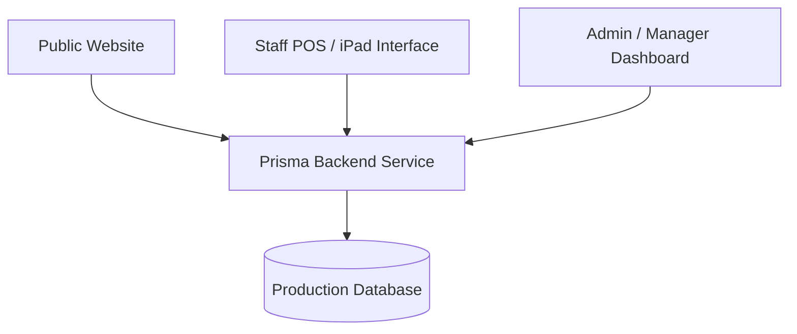
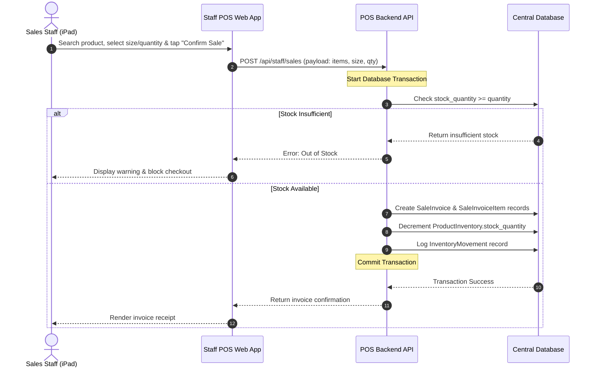

# DAHAB PERFUMES — Staff POS & iPad Inventory System Plan

This document outlines the architectural design, security guidelines, database schemas, and implementation roadmap for the future iPad-based cashier sales and inventory tracking system.

---

## 1. System Concepts & Architecture

The system will operate across three distinct environments sharing a single database and API backend:



### 1. Public Website (Customer-Facing)
* Shows product catalog and availability.
* To protect commercial data, the exact stock count is **never** shown to the public.
* Public availability labels are derived from the database:
  * **متوفر (Available):** Stock is above the low-stock threshold.
  * **كمية محدودة (Limited Quantity):** Stock is greater than 0 but at or below the low-stock threshold.
  * **غير متوفر (Out of Stock):** Stock is exactly 0.

### 2. Staff POS / iPad Interface (Cashier Area)
* Accessible via protected route (e.g. `/staff` or `/pos`).
* Designed specifically for iPad / touch-screen interfaces.
* Enables sales staff to search products, check stock numbers, add items to a sale invoice, select bottle sizes, and confirm cashier transactions.
* Confirming a sale automatically decrements central product inventory.
* **Access Limit:** Staff cannot increase stock, change product info, modify prices, or hide/show items.

### 3. Admin / Manager Dashboard (Management Office)
* Accessible via protected route `/admin`.
* Full control over products, prices, images, and users.
* Manager tools for restocking, manual inventory adjustments, viewing movement logs, viewing invoices, and monitoring sales reports.

---

## 2. Roles & Permissions

| Feature | Admin / Manager | Staff / Cashier |
|---------|-----------------|-----------------|
| View Public Catalog | Yes | Yes |
| View Product Stock Count | Yes | Yes |
| Create Sale Invoice (Decrease Stock) | Yes | Yes |
| Restock Inventory (Increase Stock) | Yes | No |
| Adjust Inventory (Corrections) | Yes | No |
| Add / Edit / Delete Products | Yes | No |
| Change Product Prices | Yes | No |
| Upload Product Images | Yes | No |
| Manage Staff Accounts / PINs | Yes | No |
| View Invoices & Financial Reports | Yes | No (Own shift only if approved) |

---

## 3. Staff Login, PINs & Security

To facilitate rapid lock/unlock on a shared cashier iPad:
- **PIN-Based Login:** Staff log in via a unique 4 to 6-digit PIN on a touch numeric pad at `/staff/login`.
- **Admin Authentication:** Managers authenticate using standard username/password combinations at `/admin/login`.
- **Session Locking:** The iPad POS automatically locks the screen after 60–120 seconds of inactivity.
- **Activity Log:** Every invoice created is tied to the logged-in staff member. Every inventory change logs `created_by`.

### Security Requirements:
* PINs/passwords must be hashed using a strong hashing algorithm (e.g. `bcrypt`). Plaintext passwords must never be stored.
* API requests for staff and admin endpoints must be protected by session tokens (JWT or HttpOnly cookies).
* Login attempts must be rate-limited to prevent brute-force PIN attacks.
* Production transactions must run over HTTPS.

---

## 4. Idle / Showcase Screen Spec

To maintain store aesthetics and protect data privacy, the iPad POS will enter showcase mode when idle:
* **Trigger:** Activated after 60–120 seconds of inactivity.
* **Visuals:** Shows a clean, luxury branded screen with the DAHAB PERFUMES logo, signature black-and-gold color scheme, and optional elegant transitions. No product names, stock counts, or sales data are exposed.
* **Exit:** Any touch or tap on the showcase screen exits the idle screen and displays the Staff PIN Unlock screen.
* **Technical Note:** Since this runs in a web app/PWA context, it cannot override iPad OS system sleep settings. The store iPad should have its display Auto-Lock configured to "Never" or a long duration to prevent OS sleep. The app should be installable as a Progressive Web App (PWA) to hide browser chrome and run full-screen.

---

## 5. Proposed Database Models

Conceptual models to be added to `schema.prisma` in future phases:

```prisma
model StaffUser {
  id            String             @id @default(uuid())
  name          String
  username      String             @unique
  pin_hash      String             // Encrypted 4-6 digit login PIN
  role          Role               @default(STAFF) // enum: ADMIN, MANAGER, STAFF
  active        Boolean            @default(true)
  created_at    DateTime           @default(now())
  updated_at    DateTime           @updatedAt
  movements     InventoryMovement[]
  invoices      SaleInvoice[]
}

enum Role {
  ADMIN
  MANAGER
  STAFF
}

model ProductInventory {
  id                  String   @id @default(uuid())
  productId           String   @unique
  stock_quantity      Int      @default(0) // Inventory is product-level only (not size-level)
  low_stock_threshold Int      @default(5)
  track_inventory     Boolean  @default(true)
  updated_at          DateTime @updatedAt
  product             Product  @relation(fields: [productId], references: [id], onDelete: Cascade)
}

model SaleInvoice {
  id             String            @id @default(uuid())
  invoice_number String            @unique
  staffId        String
  subtotal_fils  Int
  discount_fils  Int               @default(0)
  total_fils     Int
  payment_method PaymentMethod     @default(CASH) // enum: CASH, CARD, OTHER
  note           String?
  created_at     DateTime          @default(now())
  staff          StaffUser         @relation(fields: [staffId], references: [id])
  items          SaleInvoiceItem[]
  movements      InventoryMovement[]
}

enum PaymentMethod {
  CASH
  CARD
  OTHER
}

model SaleInvoiceItem {
  id               String      @id @default(uuid())
  invoiceId        String
  productId        String
  sku              String      // Snapshot at time of purchase
  product_name_ar  String      // Snapshot at time of purchase
  selected_size    String      // E.g., "50ml", "100ml", "200ml" (for invoice records only)
  quantity         Int
  unit_price_fils  Int
  total_fils       Int
  invoice          SaleInvoice @relation(fields: [invoiceId], references: [id], onDelete: Cascade)
}

model InventoryMovement {
  id            String         @id @default(uuid())
  productId     String
  type          MovementType   // enum: SALE, RESTOCK, ADJUSTMENT, CORRECTION, VOID
  quantity      Int            // Positive for additions, negative for deductions
  old_quantity  Int
  new_quantity  Int
  invoiceId     String?
  created_by    String         // StaffUser.id
  note          String?
  created_at    DateTime       @default(now())
  staff         StaffUser      @relation(fields: [created_by], references: [id])
  invoice       SaleInvoice?   @relation(fields: [invoiceId], references: [id])
}

enum MovementType {
  SALE
  RESTOCK
  ADJUSTMENT
  CORRECTION
  VOID
}
```

---

## 6. Sale Flow & Stock Synchronization



### Synchronization Architecture
* **Real-time Sync:** The Staff POS iPad app and the public website connect to the same central database in production.
* **Double-booking Prevention:** Stock decrement must be evaluated and performed server-side within a strict SQL database transaction to prevent race conditions (e.g. two iPad devices selling the last piece simultaneously).
* **Production Database Note:** While SQLite file-based storage works locally, production sync requires a server-compatible database like managed **PostgreSQL** (Neon, Supabase, etc.) to handle concurrent connection pools.

---

## 7. Invoice & Receipt Spec

The internal electronic invoice/receipt generated by the POS must contain:
1. **Header:** DAHAB PERFUMES (Arabic/English store details)
2. **Transaction Details:** Invoice Number, Date & Time, Payment Method (Cash/Card), Cashier/Staff Name
3. **Itemized Table:** Product Name (Arabic), SKU, Selected size (50ml/100ml/200ml), Quantity, Unit Price (JOD), Total Line Price (JOD)
4. **Totals:** Subtotal, Discount (if applied), Final Total order amount in JOD
5. **Footer Notes:** (Optional cashier notes or return policy guidelines)

*Note: This is an internal store receipt. If integration with official government tax/fiscal invoicing authorities is required, those structural specifications must be reviewed prior to database schema finalization.*

---

## 8. Conceptual API Endpoints

All endpoints under `/api/staff/*` and `/api/admin/*` are conceptual and require authentication middlewares.

### Staff POS APIs (Accessible to Cashier & Admin)
* `POST /api/staff/login` — PIN-based authentication, returns staff session token.
* `GET /api/staff/products/search` — Search catalog by term (SKU, name, category, family).
* `GET /api/staff/products/[sku]` — Retrieve specific product, price array, and current stock.
* `POST /api/staff/sales` — Submit transaction. Validates stock, decrements quantity, logs movement, returns receipt.
* `GET /api/staff/sales/recent` — Fetch cashier's transaction history for the active shift.

### Management APIs (Strictly Restricted to Admin/Manager Roles)
* `GET /api/admin/products` — List all products (including invisible/needs_review products).
* `POST /api/admin/products` — Create a new catalog product.
* `PATCH /api/admin/products/[id]` — Edit metadata, visibility, image references, or pricing.
* `PATCH /api/admin/inventory/[productId]` — Restock or manually adjust inventory. Logs `RESTOCK`/`ADJUSTMENT`.
* `GET /api/admin/inventory/movements` — Fetch complete audit trail of stock movements.
* `GET /api/admin/sales` — Retrieve comprehensive store invoices, filterable by date, staff, or payment method.
* `GET /api/admin/reports` — Financial summaries, profit, popular product matrices, and low-stock alerts.
* `POST /api/admin/staff-users` — Add or modify staff logins and role configurations.

---

## 9. Implementation Roadmap

### Phase 1: Authentication & Roles Foundation
- Add `StaffUser` model to schema.
- Implement PIN hashing utility.
- Build Next.js API route middleware to validate session tokens.
- Implement login page `/staff/login` and manager credentials gate `/admin/login`.

### Phase 2: Inventory Schema & Setup
- Add `ProductInventory` model to database.
- Create migrations and populate initial stock counts.
- Add inventory display fields to manager dashboard `/admin`.

### Phase 3: Staff POS Checkout Flow
- Build touch-friendly product search and invoice builder interfaces.
- Create `/api/staff/sales` endpoint using Prisma transactions.
- Implement auto-decrementing logic and movement logging (`InventoryMovement`).

### Phase 4: Inventory Auditing & Dashboard Tools
- Build manual stock adjustment and restock interfaces for Admin.
- Build the inventory movements log view.
- Create sales reports, financial charts, and receipt lookup screens.

### Phase 5: PWA Integration & Showcase Mode
- Convert the cashier application into an installable PWA for full-screen iPad usage.
- Implement the branded idle/showcase screen overlay.
- Configure automatic lock/PIN screen timeouts for inactive POS sessions.
